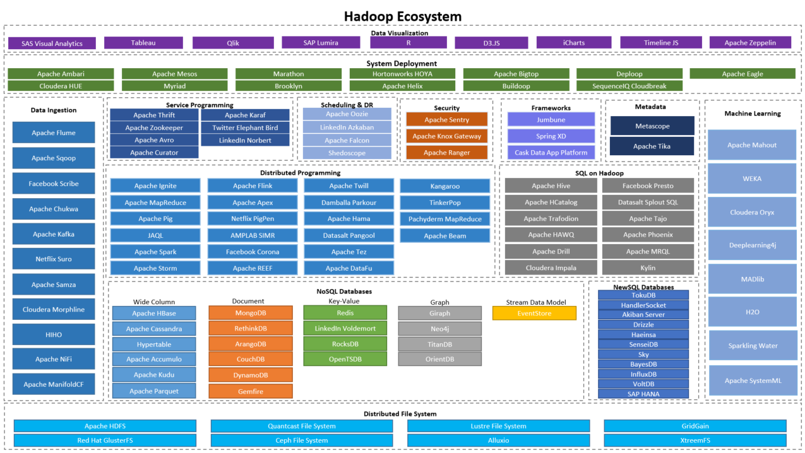

# Hadoop Ecosystem

in progres..

Системы для работы с большими данными состоят из многих компонент:

Ещё больше тут: [Big Data Landscape 2021](https://cloud.mail.ru/public/xqZH/yE4cb94e1)

## В 2022 году сервисы уходят в Cloud Computing:

Аналоги Cloud Computing сервисов Google, AWS и Azure: [cloud.google.com/aws-azure-gcp](https://cloud.google.com/free/docs/aws-azure-gcp-service-comparison) ([копия webarchive](https://web.archive.org/web/20221005003812/https://cloud.google.com/free/docs/aws-azure-gcp-service-comparison)).

Yandex Cloud:
- [AWS](https://cloud.yandex.com/en/docs/overview/platform-comparison/aws)
- [Google Cloud](https://cloud.yandex.com/en/docs/overview/platform-comparison/gcp)
- [Azure](https://cloud.yandex.com/en/docs/overview/platform-comparison/azure)

## Обзор сервисов связанных с Hadoop:

№  | Сервис    | Что делает
---|-----------|--------------------
1  | Ambari	   | Обеспечивает управление и контроль кластера Hadoop, а также интеграцию Hadoop с существующей корпоративной инфраструктурой
2  | HBase	   | Работает поверх распределенной файловой системы HDFS и обеспечивает возможности BigTable для Hadoop, реализуя отказоустойчивый способ хранения больших объемов распределенных данных
3  | HDFS	     | Распределенная файловая система для отказоустойчивого хранения больших объемов данных. HDFS также разработан для возможности параллельной обработки данных
4	 | Hive	     | Инструмент инфраструктуры хранилища данных для обработки структурированных данных в Hadoop. Он находится на верхнем слое Hadoop для обобщения данных и облегчает запросы и анализ
5	 | HUE	     | Веб-приложение для графического использования основных приложений Hadoop Ecosystem. Hue предоставляет интерфейсы для взаимодействия с такими компонентами, как: HDFS, MapReduce, Hive и Spark
6	 | MapReduce | Разбивает задачу на мелкие части и распределяет их по множеству "компьютеров". Позже результаты собираются в одном месте и интегрируются для формирования результирующего набора данных
7	 | Oozie	   | Проект с открытым исходным кодом на основе технологии Java, упрощающий процесс создания потоков работ и координацию заданий. Oozie предоставляет принципиальную возможность объединения нескольких последовательно выполняемых заданий в одну логическую единицу работы. Oozie полностью интегрирован со стеком Hadoop и поддерживает задания Hadoop для MapReduce, Pig, Hive и Sqoop
8	 | Solr	     | Платформа полнотекстового поиска с открытым исходным кодом, основанная на проекте Apache Lucence
9  | Sqoop	   | Инструмент, предназначенный для передачи данных между Hadoop и реляционными базами данных или мэйнфреймами
10 | Tez	     | Платформа на основе YARN, которая обеспечивает высокопроизводительную обработку данных в Hadoop. Основная особенность Tez заключается в создании DAG (directed acyclic graph — направленного ациклического графа) и часто используется как альтернатива Hadoop MapReduce
11 | YARN	     | Связывает блок хранения Hadoop, то есть HDFS (распределенная файловая система Hadoop), с различными инструментами обработки. Основная идея YARN - облегчить MapReduce, взяв на себя ответственность за управление ресурсами и планирование работ. YARN предоставляет Hadoop возможность запускать задания, не связанные с MapReduce, в рамках Hadoop
12 | Zookeeper | Централизованная служба для поддержки информации о конфигурации, именования, обеспечения распределенной синхронизации и предоставления групповых служб
