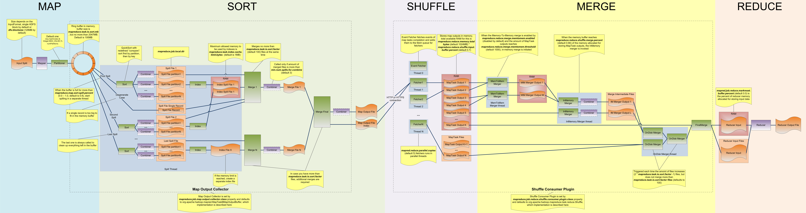
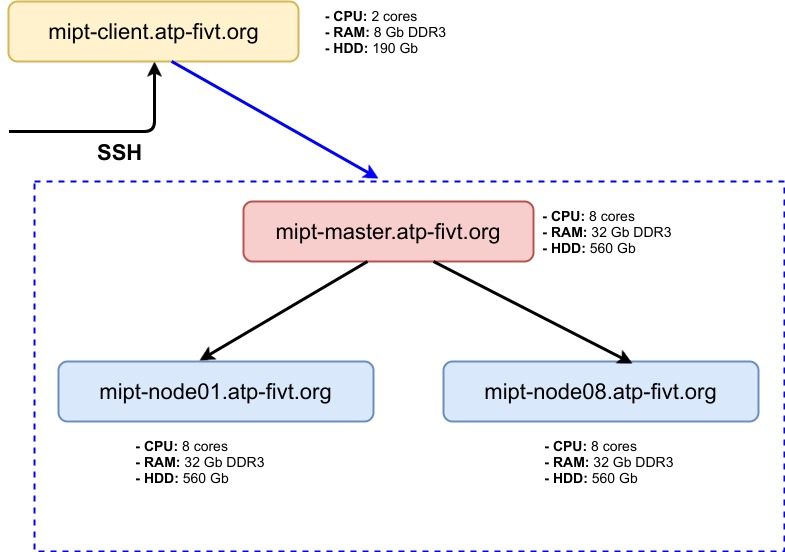

Форма для отзывов: https://forms.gle/kkcPJtXRsJKmKyNo8. Также, я буду благодарен за Merge Request-ы в этом репозитории.

# Seminar 7

https://gitlab.com/fpmi-atp/pd2022a-supplementary/global/-/blob/main/materials/08-mapreduce_part1.md

# MapReduce 1

Важная терминология, будет использовать во всех темах по Hadoop:

- Application -- задача в целом, задача состоит из джоб. Один `hadoop jar ..` создает одну джобу, в случае цепочек создается столько джоб, сколько `hadoop jar ..` было задано.  
- Джоба -- состоит из тасок маппера и тасок редьюсера.
- Таска -- если запускаем на 8 редьсерах, то у редьсера будет 8 тасок; аналогично с маппером.
- Attempt -- у таски есть нескольких attempt-ов. Если первый attempt падает с ошибкой, то запускается второй. Максимальное количество attempt-ов настраивается, но обычно их 3. Если 3 attempt-а упали, то таска становится Failed.

Концептуальная схема MapReduce:


Подробная схема:

https://hadoop.apache.org/docs/stable/hadoop-mapreduce-client/hadoop-mapreduce-client-core/MapReduceTutorial.html



При помощи [oozie](https://oozie.apache.org/) или [luigi](https://github.com/spotify/luigi) MapReduce задачи можно объединить в сложные последовательности:


Напоминание наш кластер:



Заходим на кластер: `$ ssh <username>@mipt-client.atp-fivt.org -L 8088:mipt-master:8088 -L 19888:mipt-master:19888 -L 8888:mipt-node03:8888`. Значения XXX см. на почте в письме от automation@atp-fivt.org.
  
В случае проблем с доступами или ключами заходим по логину `hdfsuser` (пароль `hdfsuser`). Это не желательно т.к. у вас в этом случае будет общая очередь на кластере.
 
 Порты:
 - `8088` -- All Applications, развернут на mipt-master -- интерфес для просмотра запущенных задач (application, джобы, таски, attempt-ы). После проброса порта сервис открывается по ссылке `http://localhost:8088/`. Полезно смотреть на `Memory Used` и `Memory Total`, на `VCores Used` и `VCores Total` в верху таблицы. Если ресурсов на кластере мало, то есть используется почти вся память или почти все ядра, то могут долго не запускаться новые задачи. Тогда смотрим в таблице кто съедает больше всех ресурсов и пишем в чат что нет ресурсов.
 - `19888` -- JobHistory, развернут на mipt-master -- история с запущенными Джобами.
 - `8888` -- Hue, развернут на mipt-node03 -- UI для работы с Hadoop. **!** Внимание, по умолчанию локальный юпитер ноутбук стартует тоже на 8888 порту, поэтому Hue может не открыться, если у вас запущен юпитер ноутбук. Чтобы решить эту проблему пробрасываем порт как `8889:mipt-node03:8888`.
 
## First run

Для запуска MapReduce джобы используем [Hadoop Streaming](https://hadoop.apache.org/docs/r1.2.1/streaming.html) (на самом деле streaming в названии не имеет отношения к потоковой обратбоке данных, чем например занимается Kafka). Hadoop Streaming -- интерфейс для запуска задач поверх Java. 

Рассмотрим задачу подсчета сколько раз слово встретилось в тексте (word count). Логика решения задачи:

1. **Read.** Считывает данные из входного пути, разбивает на сплиты (обычно размер сплита = размер HDFS-блока), распределяет сплиты по мапперам.

2. **Mapper.** Получает на вход данные построчно и разбивает по словам. На выходе пары `(слово, 1)`.

3. **Shuffle & sort.** Сортирует данные по ключу (слово) и передаёт их в таком виде, чтоб все строки с одинаковыми ключами гарантированно пошли на 1 reducer.

4. **Reducer.** Суммирует кол-ва слов с одинаковыми ключами. Ключи приходят упорядоченно, т.е. не может прийти k2 пока не закончились пары с k1. На выходе пары `(слово, кол-во)`.

Исходник: `/home/velkerr/seminars/pd2020/01-wordcount`. В папке лежит несколько файлов, сначала рассмотрим `run.sh`:

```bash
OUT_DIR="streaming_wc_result"
NUM_REDUCERS=8

hadoop fs -rm -r -skipTrash $OUT_DIR*  # удаляем результаты предыдущего запуска (HDFS не перезаписывает данные поэтому без удаления выдаст ошибку о том, что путь занят).

yarn jar /opt/cloudera/parcels/CDH/lib/hadoop-mapreduce/hadoop-streaming.jar \  # подключаем jar-файл с инструментами Hadoop Streaming
    -D mapreduce.job.reduces=${NUM_REDUCERS} \  # устанавливаем кол-во reducer'ов в задаче
    -files mapper.py,reducer.py \  # добавляем файлы в distributed cache чтоб каждая нода имела к ним доступ
    -mapper mapper.py \  # для такой записи файлы должны быть исполняемыми
    -reducer reducer.py \  # в противном случае пишем `python mapper.py`, `bash mapper.py` в зависимости о того, на чём написан код.
    -input /data/wiki/en_articles_part \  # входны и выходные данные
    -output $OUT_DIR # относительный путь (= /user/par2018XX/${OUT_DIR})

# Проверка результата.
# Каждый reducer генерирует вывод в свой файл. Файлы имеют вид `part-XXXXX`.
for num in `seq 0 $(($NUM_REDUCERS - 1))`
do
    hdfs dfs -cat ${OUT_DIR}/part-0000$num | head  # Выводим 1-е 10 строк из каждого файла. 
done
```

Запускаем:
```bash
bash run.sh
```

Замечания по скрипту:

1. В начале подключаем .jar файл с hadoop streaming -- hadoop streaming -- это интерфейс поверх Java.
2. При выполнении работы команд `hadoop fs -rm -r ..`, `yarn jar ..` будут писаться логи в перемешку с результатами работы программы, поэтому, чтобы убрать этот вывод, пишем `hadoop fs -rm -r .. >/dev/null`, `yarn jar .. >/dev/null` (что-то из логов будет писаться в терминал, но оно не создаст нам проблем).
3. Помещение файлов в distributed cache требуется, чтобы скрипты были распространены по всем нодам, которые будут выполнять Джобу. Вообще в distributed cache можно поместить и маленький файл, но об смотри следующий семинар.
4. В `-mapper` и `-reducer` передаем скрипты, которые будут выполнять функции маппера и редьюсера. На месте `mapper.py` и `reducer.py` могут быть и другие скрипты, например bash (в частности команда `cat`, если маппер/редьсер не должны выполнять преобразования).
5. При запуске `run.sh` в логах видим статус выполнения джобы (`22/10/30 16:19:04 INFO mapreduce.Job:  map 83% reduce 0%`). Эту информацию можно найти и в Hue.
6. Первое слово в выводе: `!	250`. Это логично, на этапе `shuffle and sort` ключи отсортировались в лексикографическом порядке, при этом мы не фильтровали мусор в тексте.
7. Чтобы дать название задаче добавляем `-D mapred.job.name="my_wordcout_example"`

## Отладка MapReduce задач:

### Пример как искать ошибки

Как дебажить код: попробуем добавить ошибку в `mapper.py` (например уберем закрывающуюся скобку). В терминале видим ошибку: `mapreduce.Job: Task Id : attempt_1665490806436_0462_m_000000_0, Status : FAILED Error: java.lang.RuntimeException: PipeMapRed.waitOutputThreads():`. Это значит, что редьюсер не получил данные. Заходим на `http://localhost:19888/jobhistory`. Находим задачу по названию, открываем:


Жмем на `Map`:


Жмем на название таски `ask_1665490806436_0462_m_000000`:


У attempt-а нажимаем на `logs`:


Тут видно что ошибка в `mapper.py` в строке 14.

### Запуск через pipe '|'

Эмуляция работы Hadoop с помощью bash-скрипта: `cat my_data.txt | ./mapper.py | sort | ./reducer.py`. Пример лежит: `/home/velkerr/seminars/pd2020/01-wordcount/test_local.sh`.

### Запуск Hadoop в локальном режиме

Запуск такой же, как и в распределённом, но нужно прописать после "yarn" специальный конфиг: `--config /opt/cloudera/parcels/CDH/etc/hadoop/conf.empty`

При этом программа будет читать и писать уже не в HDFS, а в локальную файловую систему.

При локальном запуске reducer будет всегда 1 (вне зависимости от кол-ва в streaming-драйвере).
Исходник: `/home/velkerr/seminars/pd2020/01-wordcount/run_local.sh`

## Combiner

Бывает так, что на выходе мапперов имеются данные, пригодные для аггрегации. Если мы их саггрегируем до reduce-стадии, это сэконмит ресурсы reducer'ов. Для этого существет `combiner`. Его формальная модель такая же, как и у reducer'a: `(k, v1), (k, v2) -> (k, [v1, v2])`, но реализация имеет 2 отличия:

- combiner вызывается на выходе одного маппера,
- система не даёт гарантий, сколько раз выполнится combiner и выполнится вообще.

То есть идея такая: вместо того чтобы на выходе маппера было n строк `aaa 1`, будет одна строка `aaa n`.

## Объединение нескольких задач

В реальной жизни Hadoop-программы состоят из большого кол-ва задач, которые выполняются в разной последовательности и образуют направленный граф вычислений (DAG). Побробуем отсортировать слова по частоте встречаемости.
Исходник: `/home/velkerr/seminars/pd2020/03-chaining`

Тут выводится топ 10 из `{OUT_DIR}/part-00000` (а всего таких файлов столько же сколько редьюсеров). Чтобы вывести топ 10 среди всех слов, надо добавить третью MapReduce задачу с одним редьюсером, где маппер и редьюсер будут просто команды `cat` (сортировка MapReduce сделает всю работу за нас).

Результат моего запуска отразился в JobHistory (http://localhost:19888/jobhistory):


Первая джоба была названа `Straming wordCount`, у второй название прописано не было и сгенерировалось `streamjob7511621456840391940.jar`.
 
## Сортировка

### Грязный хак

Рассмотрим скрипт `/home/velkerr/seminars/pd2020/03-chaining/reducer_inverse.py`.

По умолчанию сортировка лексикографическая и по возрастанию, чтобы добиться сортировки по убыванию делаем так `key = 99999 - int(key)`. Конечно это плохо, поэтому сразу переходим к компаратору.

### Используем компарартор:

Скрипт `/home/velkerr/seminars/pd2020/03-chaining/run1.sh`.

Тут добавляется строка `-D mapred.text.key.comparator.options=-k1,2`, отвечающая за сортировку. В Hadoop Streaming параметры компаратора наследуют логику `sort` в bash. Подробнее  [тут](https://linuxhint.com/sort-bash-column-linux/).

## Пример: подсчёт числа Пи

Оценить значение числа PI методом Монте Карло.

[Статья на Хабре](https://habr.com/ru/post/128454/)

`/home/velkerr/seminars/pd2020/07_pi_stub`

1. Копируем папку к себе: `cp -r ../07_pi_stub ~/07_pi_stub`.
2. Идем в свою корневую директорию: `cd ~`, открываем папку `cd 07_pi_stub`.
3. Запускаем `./generate.py 1000` -- сгенерируется 1000 точек, они запишутся в 10 файлов в папке `pi_points`.
4. Создаем папку pi_result в hdfs: `hdfs dfs -mkdir pi_result`.
5. Кладем файлы с сгенерированными точками в hdfs: `hdfs dfs -put pi_points`.
6. Запускаем `bash run.sh`.
7. Смотрим результаты `hdfs dfs -cat pi_result/part-00000`.

# Материалы

1. https://www.michael-noll.com/tutorials/writing-an-hadoop-mapreduce-program-in-python/
2. https://github.com/Ebazhanov/linkedin-skill-assessments-quizzes/blob/main/hadoop/hadoop-quiz.md
3. https://cloud.yandex.ru/services/data-proc
4. [https://sber.ru/legal/data_platform/](https://sber.ru/legal/data_platform/#SDP_Hadoop)
5. YT - MapReduce сисетма Яндекса (аналог Hadoop) https://habr.com/ru/companies/yandex/articles/311104/
